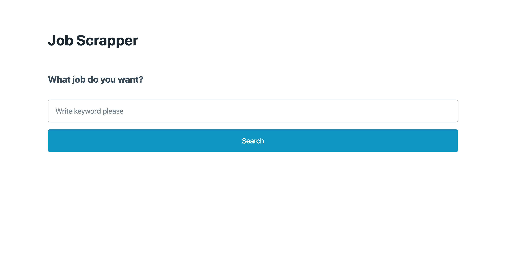
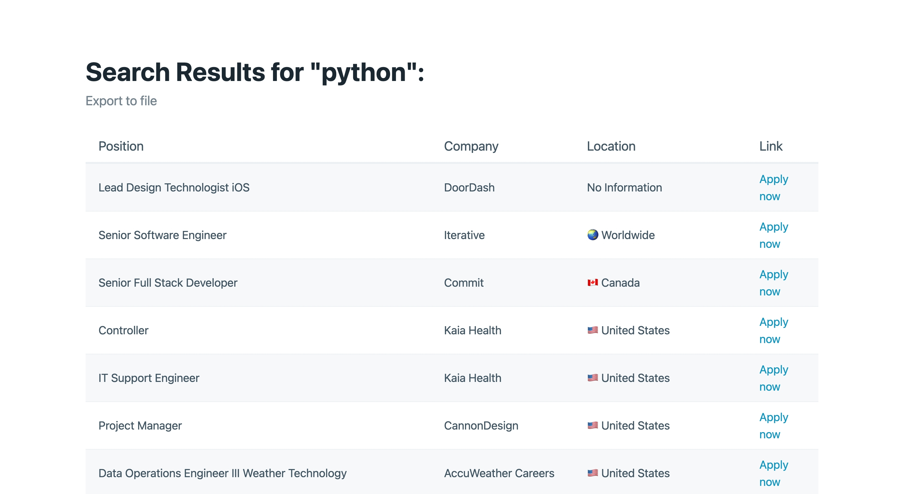

# Job Scrapper

## 배포 URL
[https://job-scrapper.nageune.repl.co](https://job-scrapper.nageune.repl.co)

## 기능
- 언어(`python`, `react`, `java` 등)를 검색하면 직업을 찾아줍니다.
- [https://remoteok.com](https://remoteok.com) 와 [https://weworkremotely.com](https://weworkremotely.com) 에서 직업 정보를 스크랩합니다.
- 직업 정보를 `csv` 파일로 다운로드할 수 있습니다.

## Tech Stack

